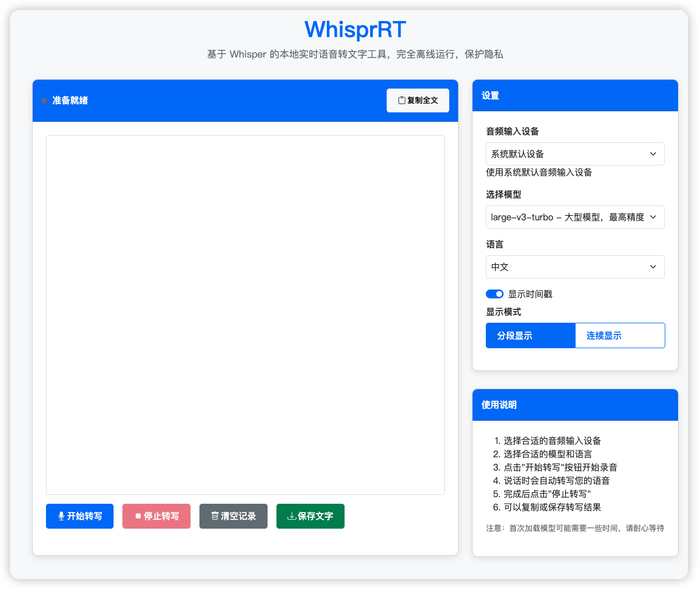

# WhisprRT

<p align="center">
  <a href="https://github.com/zhengjim/WhisprRT"></a>
  <a href="https://fastapi.tiangolo.com"></a>
  <a href="https://github.com/zhengjim/WhisprRT"></a>
  <a href="https://github.com/zhengjim/WhisprRT/blob/main/LICENSE"></a>
</p>

**WhisprRT** 是一个基于 [OpenAI Whisper](https://github.com/openai/whisper) 的本地实时语音转文字工具，支持完全离线运行。借助 FastAPI 提供轻量网页服务，快速、稳定、隐私安全，适用于会议记录、日常笔记、个人助手等多种场景。

---
## 前言

现在市面上的实时语音转文字工具，大多数都需要传音频来转(云端或本地)，实时语音转文字的，大多数都收费。免费的基本都会有时间或者次数限制，想一直用下去也挺麻烦的。

了解了下如何实现的，干脆自己做一个，完全本地离线跑，不上传音频、不用担心隐私问题，也没有时长限制，想用多久用多久。

## 功能亮点

- 🚀 **实时转写**：低延迟，快速将语音转为文字。
- 🔒 **100% 离线**：无需联网，数据不上传，隐私有保障。
- 🌐 **网页界面**：通过 FastAPI 提供简洁易用的前端。
- 🛡️ **反幻觉优化**：过滤，减少 large-v3-turbo 模型的幻觉内容。

---

## 程序截图



---
## 使用场景

- **会议纪要**：实时记录会议内容，高效整理。
- **个人笔记**：随时将灵感语音转为文字。
- **学习辅助**：转写讲座或课程，方便复习。
- **内容创作**：快速将口述内容转为文字草稿。

---

## 快速开始

### 前置要求

- **Python**：3.13（推荐）或更高版本
  - ⚠️ **注意**：由于 `onnxruntime` 的兼容性限制，当前仅支持 Python 3.13。Python 3.14 暂不支持，请使用 Python 3.13。
- **uv**：推荐的 Python 包管理工具（[安装指南](https://github.com/astral-sh/uv)）
- **操作系统**：Windows、MacOS 或 Linux

### 安装步骤

#### Windows 用户

1. **安装 Python 和 uv**：
   - 下载并安装 Python 3.13（⚠️ 请使用 3.13 版本，不要使用 3.14）：[Python 3.13 下载](https://www.python.org/downloads/release/python-3130/)
   - 安装 uv（推荐使用 PowerShell）：
     ```powershell
     powershell -ExecutionPolicy ByPass -c "irm https://astral.sh/uv/install.ps1 | iex"
     ```
   或者使用 pip 安装：
     ```powershell
     pip install uv
     ```

2. **克隆项目并进入目录**：
   ```powershell
   git clone https://github.com/zhengjim/WhisprRT.git
   cd WhisprRT
   ```

3. **安装依赖**：
   ```powershell
   uv python install 3.13  # 这个音频似乎只支持3.13
   uv venv --python 3.13 .venv
   uv sync
   # 启动
   uv run python -m app.main 
   ```

4. **激活虚拟环境并启动服务**：
   
   **方式一：使用 Python 命令（推荐，最简单）**
   ```powershell
   # PowerShell
   .venv\Scripts\Activate.ps1
   下载依赖： python -m pip install -e . 如果venv中没有pip需要先下载 python -m ensurepip --upgrade
   python -m app.main
   ```
   ```cmd
   # CMD
   .venv\Scripts\activate.bat
   python -m app.main
   ```
   
   **方式二：使用 uvicorn 命令**
   ```powershell
   # PowerShell
   .venv\Scripts\Activate.ps1
   uvicorn app.main:app --reload --port 5444
   ```
   ```cmd
   # CMD
   .venv\Scripts\activate.bat
   uvicorn app.main:app --reload --port 5444
   ```
   
   如果 PowerShell 遇到执行策略错误，先运行：
   ```powershell
   Set-ExecutionPolicy -ExecutionPolicy RemoteSigned -Scope CurrentUser
   ```
   
   **方式三：使用启动脚本（最简单）**
   - 双击运行 `start.bat`（适用于 CMD）
   - 或在 PowerShell 中运行：`.\start.ps1`

5. **打开浏览器，访问**：
   ```
   http://127.0.0.1:5444
   ```
   
   > **注意**：默认端口为 5444（可在 `app/config.py` 中修改）

#### Linux/MacOS 用户

1. 克隆项目并进入目录：

   ```bash
   git clone https://github.com/zhengjim/WhisprRT.git
   cd WhisprRT
   ```

2. 安装依赖：

   ```bash
   uv sync
   ```

3. 激活虚拟环境：

   ```bash
   source .venv/bin/activate
   ```

4. 启动服务：

   ```bash
   # 方式一：使用 Python 命令（推荐）
   python -m app.main
   
   # 方式二：使用 uvicorn 命令
   uvicorn app.main:app --reload --port 5444
   ```

5. 打开浏览器，访问：

   ```
   http://127.0.0.1:5444
   ```

> **注意**：
> - 默认端口为 5444（可在 `app/config.py` 中修改）
> - 建议仅在 `127.0.0.1` 运行，防止未经授权的访问

### 推荐模型

默认使用 `large-v3-turbo` 模型，兼顾速度与准确性。性能较低的设备可切换其他模型（详见[模型选择](#模型选择)）。

---

## 使用示例

WhisprRT 使用示例

https://i.imgur.com/LbsAucR.gif

---

## 录制电脑音频

- **MacOS**：使用 [BlackHole](https://github.com/ExistentialAudio/BlackHole) 录制系统音频。
- **Windows**：使用 [VB-CABLE](https://vb-audio.com/Cable/) 录制系统音频。

详细教程参考 [Buzz 文档](https://chidiwilliams.github.io/buzz/zh/docs/usage/live_recording)。

---

## 模型选择

WhisprRT 默认使用 `large-v3-turbo` 模型，推荐优先使用。如果需要切换模型，可在配置文件中调整：

| 模型              | 性能要求 | 转写速度 | 准确性 |
|-------------------|----------|----------|--------|
| large-v3-turbo    | 中等     | 快       | 高     |
| medium            | 低       | 中       | 中     |
| small             | 极低     | 慢       | 低     |

> **提示**：实时转写对性能敏感，建议根据硬件选择合适的模型。

---

## 反幻觉功能

针对 `large-v3-turbo` 模型容易出现的幻觉问题（如重复广告文字："优优独播剧场"、"请不吝点赞"等），WhisprRT 内置了多层过滤机制：

### 🛡️ 核心优化

1. **参数调优**
   - 降低 `temperature` 至 0.0 减少随机性
   - 提高 `no_speech_threshold` 至 0.6 强化静音检测
   - 禁用 `condition_on_prev_tokens` 避免循环依赖

2. **智能过滤**
   - 内置 15+ 幻觉内容检测模式
   - 自动识别重复文本模式
   - 置信度门槛过滤低质量结果

3. **音频预处理**
   - 增强静音检测（能量+零交叉率+频谱分析）
   - 高通滤波去除低频噪音
   - 归一化处理提升识别准确性

### 🔧 参数调整

可通过 API 动态调整反幻觉参数：

```bash
# 获取当前配置
curl http://127.0.0.1:8000/anti_hallucination_config

# 更新参数
curl -X POST http://127.0.0.1:8000/update_anti_hallucination_config \
  -H "Content-Type: application/json" \
  -d '{"confidence_threshold": 0.7, "silence_threshold": 0.003}'

# 重置为默认值
curl -X POST http://127.0.0.1:8000/reset_anti_hallucination_config
```

### 🧪 测试验证

运行内置测试脚本验证反幻觉功能：

```bash
python test_anti_hallucination.py
```

测试内容包括：
- 幻觉内容检测准确性
- 音频预处理效果
- 转写质量验证
- API 配置功能

---

## 常见问题解答（FAQ）

### 1. WhisprRT 需要联网吗？
不需要，WhisprRT 100% 离线运行，音频数据不上传，保护隐私。

### 2. 安装时提示 "onnxruntime can't be installed" 或 "Error querying device -1"？
这通常是 Python 版本兼容性问题：

**问题原因：**
- `onnxruntime` 1.23.2（`faster-whisper` 的依赖）目前只支持 Python 3.13
- 如果您使用的是 Python 3.14，会出现兼容性问题

**解决方案：**
1. **降级到 Python 3.13**（推荐）：
   - 卸载 Python 3.14
   - 安装 Python 3.13：[下载地址](https://www.python.org/downloads/release/python-3130/)
   - 重新运行 `uv sync`

2. **检查 Python 版本**：
   ```powershell
   python --version
   ```
   确保显示的是 `Python 3.13.x`

> **注意**：项目要求 Python 3.13，暂不支持 Python 3.14。请使用 Python 3.13 版本。

### 3. 如何选择适合的模型？
优先使用 `large-v3-turbo`，性能不足时可尝试 `medium` 或 `small` 模型。

### 4. 为什么转写速度慢？
可能原因：
- 硬件性能不足，尝试切换至更轻量模型。
- 未正确配置虚拟环境，确保依赖安装完整。

### 5. 支持哪些语言？
基于 Whisper，支持多语言转写，包括中文、英文、日文等。

### 6. 如何解决 large-v3-turbo 的幻觉问题？
WhisprRT 已内置反幻觉优化，如仍有问题可：
- 通过 API 提高 `confidence_threshold`（建议 0.7-0.8）
- 降低 `silence_threshold` 强化静音检测
- 添加自定义幻觉检测模式到配置文件

### 7. 如何自定义幻觉检测模式？
编辑 `app/config.py` 中的 `HALLUCINATION_PATTERNS` 列表，添加正则表达式模式：

```python
HALLUCINATION_PATTERNS = [
    r"优优独播剧场",
    r"你的自定义模式",
    # ... 更多模式
]
```

### 8. 模型下载失败，提示连接 Hugging Face 超时？
如果遇到 `ConnectTimeoutError` 或 `LocalEntryNotFoundError`，说明无法连接到 Hugging Face 下载模型。解决方法：

**方法一：配置代理（推荐）**
```powershell
# 设置代理环境变量（根据你的代理地址修改）
$env:HTTP_PROXY = "http://127.0.0.1:7890"
$env:HTTPS_PROXY = "http://127.0.0.1:7890"
```

**方法二：使用 Hugging Face 镜像站**
```powershell
$env:HF_ENDPOINT = "https://hf-mirror.com"
```

**方法三：手动下载模型**
1. 访问 `https://huggingface.co/Systran/faster-whisper-large-v2` 或使用镜像站
2. 下载模型文件到本地缓存目录：
   ```
   C:\Users\你的用户名\.cache\huggingface\hub\models--Systran--faster-whisper-large-v2
   ```

**方法四：使用已下载的模型**
如果模型已下载到本地，WhisprRT 会自动使用本地模型，无需重新下载。

### 9. 模型下载速度太慢，卡在下载界面？
如果模型下载速度极慢（如 < 100KB/s），可以尝试以下方法：

**方法一：使用 Hugging Face CLI 下载（推荐，支持断点续传）**
```powershell
# 1. 先中断当前下载（Ctrl+C）

# 2. 使用 hf CLI 下载模型（支持断点续传，速度更快）
hf download Systran/faster-whisper-large-v2 --local-dir "C:\Users\eason\.cache\huggingface\hub\models--Systran--faster-whisper-large-v2"

# 或者下载到当前目录，然后移动到缓存目录
hf download Systran/faster-whisper-large-v2
```

**方法二：配置代理加速下载**
```powershell
# 设置代理（根据你的代理地址修改）
$env:HTTP_PROXY = "http://127.0.0.1:7890"
$env:HTTPS_PROXY = "http://127.0.0.1:7890"

# 然后重新运行 whisperx 命令
whisperx audio.wav --model large-v2 --language zh --output_dir subtitles --output_format srt --compute_type float16
```

**方法三：使用镜像站加速**
```powershell
# 设置镜像站
$env:HF_ENDPOINT = "https://hf-mirror.com"

# 重新运行命令
whisperx audio.wav --model large-v2 --language zh --output_dir subtitles --output_format srt --compute_type float16
```

**方法四：使用更小的模型（临时方案）**
如果网络问题持续，可以先使用更小的模型：
```powershell
# 使用 small 或 medium 模型（下载更快）
whisperx audio.wav --model small --language zh --output_dir subtitles --output_format srt --compute_type float16
```

**方法五：使用浏览器下载后手动放置**
1. 访问 `https://hf-mirror.com/Systran/faster-whisper-large-v2`（镜像站）
2. 使用浏览器下载工具（如 IDM、迅雷等）下载 `model.bin` 文件
3. 将文件放到缓存目录：
   ```
   C:\Users\eason\.cache\huggingface\hub\models--Systran--faster-whisper-large-v2\snapshots\main\model.bin
   ```

### 10. 提示 "Requested float16 compute type, but the target device or backend do not support efficient float16 computation"？
这个错误表示你使用了 `--compute_type float16`，但当前设备（通常是 CPU）不支持 float16 计算。

**解决方案：根据设备类型选择合适的 compute_type**

**CPU 设备（推荐）：**
```powershell
# 使用 int8（最快，推荐）
whisperx audio.wav --model large-v2 --language zh --output_dir subtitles --output_format srt --compute_type int8

# 或使用 int8_float16（平衡速度和精度）
whisperx audio.wav --model large-v2 --language zh --output_dir subtitles --output_format srt --compute_type int8_float16

# 或使用 float32（最慢但最准确）
whisperx audio.wav --model large-v2 --language zh --output_dir subtitles --output_format srt --compute_type float32
```

**GPU 设备（NVIDIA）：**
```powershell
# 如果 GPU 支持 float16（大多数现代 GPU 都支持）
whisperx audio.wav --model large-v2 --language zh --output_dir subtitles --output_format srt --device cuda --compute_type float16

# 如果 GPU 不支持 float16，使用 float32
whisperx audio.wav --model large-v2 --language zh --output_dir subtitles --output_format srt --device cuda --compute_type float32
```

**compute_type 选择建议：**
- **CPU + int8**：速度最快，内存占用最少，精度略低（推荐用于 CPU）
- **CPU + int8_float16**：速度和精度的平衡
- **CPU + float32**：最准确但最慢
- **GPU + float16**：GPU 上最快且准确（需要 GPU 支持）
- **GPU + float32**：GPU 上最准确但较慢

> **提示**：如果不确定设备类型，先尝试 `int8`（CPU）或 `float16`（GPU）。

### 11. 提示 "Weights only load failed" 或 "Unsupported global: GLOBAL omegaconf.listconfig.ListConfig"？
这是 PyTorch 2.6 版本兼容性问题。PyTorch 2.6 改变了 `torch.load` 的默认行为，导致 WhisperX 的 VAD 模型无法加载。

**解决方案：**

**方法一：降级 PyTorch（推荐）**
```powershell
# 降级到 PyTorch 2.5 或更早版本
pip install torch==2.5.1 torchvision torchaudio --index-url https://download.pytorch.org/whl/cpu

# 如果有 CUDA GPU，使用对应的 CUDA 版本
pip install torch==2.5.1 torchvision torchaudio --index-url https://download.pytorch.org/whl/cu121
```

**方法二：禁用 VAD（如果不需要语音活动检测）**
```powershell
# 添加 --no_vad 参数跳过 VAD
whisperx audio.wav --model large-v2 --language zh --output_dir subtitles --output_format srt --compute_type int8 --no_vad
```

**方法三：设置环境变量（临时方案）**
```powershell
# 设置环境变量允许加载（需要信任模型源）
$env:TORCH_WEIGHTS_ONLY = "False"
whisperx audio.wav --model large-v2 --language zh --output_dir subtitles --output_format srt --compute_type int8
```

**方法四：修改 PyTorch 加载行为（高级）**
如果必须使用 PyTorch 2.6+，需要修改 WhisperX 源码或等待官方更新。

> **推荐**：优先使用方法一（降级 PyTorch），这是最稳定的解决方案。


# batch_whisperx_nodownload

下载文字稿主要用这个：batch_whisperx_nodownload 另一个先下载再转，转2、3个就自己卡死，流程不合理
完整流程：结合插件选择，之后生成视频列表之后使用这个转文字

实现方式
三步流水线（不落盘）：
步骤	做什么	用到的工具
1. 取流地址	根据 videos.json 里的链接，拿到可直接请求的音/视频流 URL	yt-dlp（只 extract_info，不下载文件）
2. 转成模型输入	用 FFmpeg 把流解码并重采样成 16kHz、单声道、PCM，输出到 stdout	FFmpeg（管道式，Python 从 stdout 读）
3. 转写 + 后处理	把 PCM 转成 float32 数组，用 faster-whisper 转写中文，再交给通义千问做断句/摘要	faster-whisper、requests（Qwen API）
不下载：音频只在内存里（FFmpeg stdout → np.frombuffer → 模型），不写 audios/*.wav。
配置：和 batch_whisperx 共用 videos.json，输出到 subtitles/、logs/、output/。
能力边界
支持的链接：取决于 yt-dlp 能解析的站点（YouTube、B 站等），和 yt-dlp 能力一致。
时长：整段流会一次性读入内存并转写，超长视频（例如数小时）可能占很多内存或变慢；没有按“流式分块”边下边写。
语言：脚本里固定为中文（language="zh"），若要多语可改参数。
GPU：有 CUDA + cuDNN 会用 GPU，否则需设 USE_CPU=1 用 CPU；精度用 int8（可设 USE_FLOAT16=1 用 float16，需显卡支持）。
Qwen 精排：依赖通义千问 API（网络 + API Key）；失败只影响 output/ 的精排稿，原始转写仍在 subtitles/。
依赖：需要本机已安装 FFmpeg（并在 PATH 里），以及 Python 包：yt-dlp、faster-whisper、numpy、requests。
如果你愿意，我可以按「实现方式 + 能力边界」整理成一段可以放进 README 或脚本开头的简短说明文字，直接贴给你复制使用。

一、支持的平台（由 yt-dlp 决定）
只要 yt-dlp 能解析并拿到流地址 的站点都支持，例如：
YouTube、Bilibili、抖音、快手
微博、Twitter/X、Instagram
网易云音乐、QQ 音乐、Spotify（若 yt-dlp 支持）
各类新闻/博客/播客站点（带视频或音频的页面）
直链（https://xxx.mp4 / .m4a / .mp3 等）
完整列表见：
https://github.com/yt-dlp/yt-dlp/wiki/Supported-sites
限制：站点改版、登录/地区限制、反爬等可能导致部分链接取不到流，和 yt-dlp 的维护情况有关。
二、支持的音视频类型（由 FFmpeg 决定）
容器/格式：MP4、WebM、MKV、AVI、MOV、FLV、MP3、M4A、AAC、OGG、WAV 等常见格式都能解码。
编码：H.264/265、VP9、AV1、AAC、MP3、Opus 等常见编码都支持。
只要有音轨：视频会被 FFmpeg 抽成 16kHz 单声道再送给 Whisper，所以“能播的网页/链接”一般都能转写。
限制：极冷门或带强 DRM 的流，FFmpeg 可能解不了，这类无法支持。

